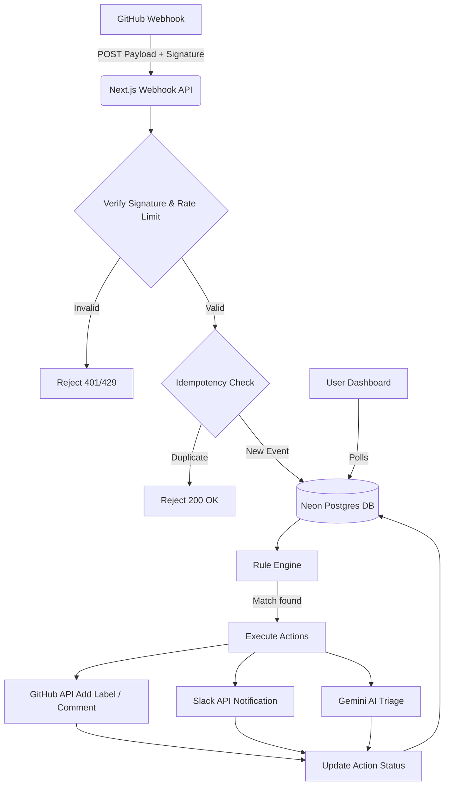

# 🤖 GitBot — Event-Driven GitHub Automation

GitBot is a production-ready, event-driven GitHub automation platform built with Next.js. It allows developers to connect their repositories, set up keyword-based rules for GitHub events, and automatically execute actions like adding labels, posting comments, and sending Slack notifications.

## 🌟 Features

- **Real-time Webhooks**: Processes GitHub issues, pull requests, and pushes instantly.
- **Rule Engine**: Create complex automation rules (e.g., "If an issue title contains `bug`, add the `bug` label and notify Slack").
- **AI Triage**: Leverages Google Gemini to automatically summarize issues/PRs and suggest intelligent labels.
- **Security First**: HMAC-SHA256 webhook signature verification, strict idempotency checks, and rate limiting.
- **Live Dashboard**: A beautiful, glassmorphism-inspired UI to monitor event logs, track successes/failures, and retry failed actions.
- **Multi-Repo Support**: Connect and manage multiple repositories seamlessly.

## 🏗️ Architecture



## 📸 Screenshots

*(Replace these with actual screenshots of your application)*

| Landing Page | Dashboard |
| --- | --- |
|  |  |

| Rule Configuration | Slack Notification |
| --- | --- |
|  |  |

## 🚀 Getting Started

### Prerequisites
- Node.js 18+
- A [Neon Postgres](https://neon.tech/) database
- A GitHub OAuth App
- A Slack Incoming Webhook
- A Google Gemini API Key

### Installation

1. Clone the repository and install dependencies:
   ```bash
   git clone <repo-url>
   cd "Event-Driven GitHub Automation Bot"
   npm install
   ```

2. Copy the environment variables:
   ```bash
   cp .env.example .env
   ```

3. Fill out the `.env` file with your actual credentials:
   - `DATABASE_URL`: Your Neon connection string
   - `GITHUB_CLIENT_ID` / `GITHUB_CLIENT_SECRET`: From your GitHub OAuth App
   - `GITHUB_WEBHOOK_SECRET`: A random string for HMAC verification
   - `AUTH_SECRET`: Generate one using `openssl rand -base64 32`
   - `SLACK_WEBHOOK_URL`: Your Slack webhook URL
   - `GEMINI_API_KEY`: Your Google AI Studio key

4. Push the database schema:
   ```bash
   npx drizzle-kit push
   ```

5. Run the development server:
   ```bash
   npm run dev
   ```

6. Expose your local server to the web (e.g., using `ngrok` or `localtunnel`) and configure your GitHub OAuth App callback URL accordingly.

## 🛠️ Tech Stack
- **Framework**: Next.js (App Router)
- **Database**: Neon Postgres with Drizzle ORM
- **Authentication**: Auth.js (NextAuth v5)
- **Styling**: Tailwind CSS + Custom CSS properties
- **Integrations**: Octokit, Slack Block Kit, Google GenAI
- **Logging**: Pino
